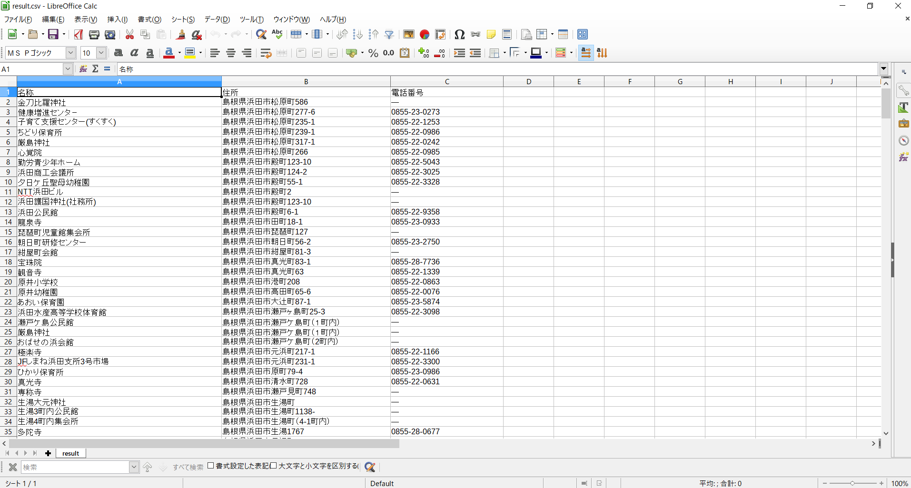

# 浜田市がCSVデータを加工してみよう!!

## 概要

浜田市が出しているCSVデータを加工できるプログラムを作ります。



## チュートリアル

まずは、浜田市の出しているCSVデータをダウンロードします。
データは島根県オープンデータカタログサイトが出している[【浜田市】指定緊急避難場所一覧](https://shimane-opendata.jp/db/dataset/hamadaevacuationspace2020)を使います。

まずは、[こちらから](./hamada.csv)使用するCSVデータをダウンロードします。


次に、`csv.rb`という名前のRubyのソースコードを作ります。
`csv.rb`には以下のコードを書きます。

```ruby
require 'csv'

CSV.foreach("hamada.csv", headers: true) do |row|
  puts row
end
```

次に、CSVを`csv.rb`と同じ場所に配置します。

`ruby csv.rb`を実行すると、ターミナルにCSVのデータが表示されると思います。

RubyではCSVを扱うためのライブラリがあり、それを使うことでCSVのデータを表示させることができています。

ただ、現在のコードだと元々のデータをそのまま全て表示しています。
そのためかなり読みにくいです。

そこで必要な項目だけを表示させるようにコードを修正していきます。

```diff
require 'csv'

CSV.foreach("hamada.csv", headers: true) do |row|
-  puts row
+  puts row["名称"]
end
```

コードを修正後、`ruby csv.rb`とターミナルで実行するとCSVデータの**名称**の項目だけが表示されていると思います。

このようにCSVの指定の項目だけを取ってくることもできます。

最後に、必要な項目だけを取ってくるように修正してみます。

```diff
require 'csv'

+ csv = CSV.open("result.csv", "wb", headers: true)
+ 
+ csv << ["名称", "住所", "電話番号"]
+
CSV.foreach("hamada.csv", headers: true) do |row|
-  puts row["名称"]
+  csv << [row["名称"], row["住所"], row["電話番号"]]
end
```

`CSV.open`では取ってきた各項目を保存するCSVデータを作成しています。
また`csv << ["名称", "住所", "電話番号"]`ではCSVのヘッダー(CSVの一番上にある各項目名)を追加しています。

`csv << [row["名称"], row["住所"], row["電話番号"]]`では読み込んだCSVデータ(避難先の一覧データ)から名称や住所などの必要な情報だけを取ってきています。

コードを修正した後、`ruby csv.rb`を実行すると`result.csv`というファイルが作成されていると思います。
そのCSVデータの中に、名称や住所などが保存されていれば完成です!

## 課題

現在のプログラムは、名称や住所を保存しています。
それ以外の項目も保存できるようにしてみましょう。