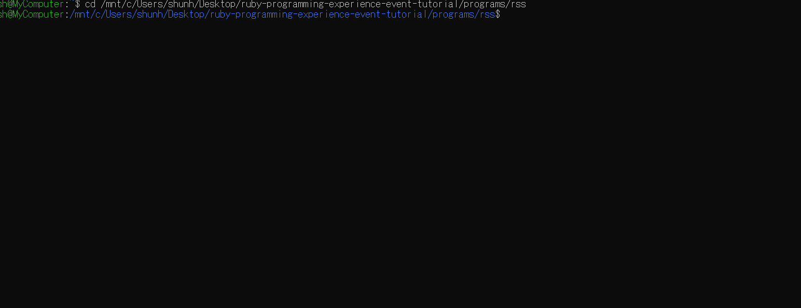

# 浜田市が出しているRSSを検索してみよう!!

## 概要

浜田市が出しているRSSフィードを検索できるプログラムを作ります。



このチュートリアルを終わった際に出来上がるソースコードは[こちら](https://github.com/Hamada-rb/ruby-programming-experience-event-tutorial/blob/master/programs/csv/csv.rb)になります

```ruby
require 'csv'

csv = CSV.open("result.csv", "wb", headers: true)

csv << ["名称", "住所", "電話番号"]

CSV.foreach("hamada.csv", headers: true) do |row|
  csv << [row["名称"], row["住所"], row["電話番号"]]
end
```

## チュートリアル

浜田市が出しているRSSフィードを使って知りたい情報だけを検索できるプログラムを作ります。

なお、使用するRSSフィードは [http://www.city.hamada.shimane.jp/www/rss/news.rdf](http://www.city.hamada.shimane.jp/www/rss/news.rdf) を使います。

まずは `hamada-rss.rb`という名前でRubyのソースファイルを作成します。

次に、`hamada-rss.rb`に以下のコードを書いていきます。

```ruby
require 'rss'

puts RSS::Parser.parse "http://www.city.hamada.shimane.jp/www/rss/news.rdf", false
```

```ruby
# RubyでRSSを扱うためのライブラリを読み込む
require 'rss'
```

このコードは、Rubyに標準で追加されているRSSフィードを扱う為のライブラリを読み込んでいます。

```ruby
# 浜田市のRSSフィードを読み込んで、読み込んだ結果を出力
puts RSS::Parser.parse "http://www.city.hamada.shimane.jp/www/rss/news.rdf", false
```

また上記のコードは浜田市のRSSフィード([http://www.city.hamada.shimane.jp/www/rss/news.rdf](http://www.city.hamada.shimane.jp/www/rss/news.rdf))を読み込んだ結果をターミナルに表示させています。

`ruby hamada-rss.rb`を実行すると以下のようにターミナルに表示されると思います。

```bash
<?xml version="1.0" encoding="UTF-8"?>
<rdf:RDF xmlns="http://purl.org/rss/1.0/"
  xmlns:rdf="http://www.w3.org/1999/02/22-rdf-syntax-ns#"
  xmlns:content="http://purl.org/rss/1.0/modules/content/"
  xmlns:dc="http://purl.org/dc/elements/1.1/"
  xmlns:image="http://purl.org/rss/1.0/modules/image/"
  xmlns:slash="http://purl.org/rss/1.0/modules/slash/"
  xmlns:sy="http://purl.org/rss/1.0/modules/syndication/"
  xmlns:taxo="http://purl.org/rss/1.0/modules/taxonomy/"
  xmlns:trackback="http://madskills.com/public/xml/rss/module/trackback/">
  <channel rdf:about="https://www.city.hamada.shimane.jp/www/rss/news.rdf">
    <title>浜田市ホームページ</title>
    <link>https://www.city.hamada.shimane.jp/www/toppage/0000000000000/APM03000.html</link>
    <description>浜田市ホームページの新着情報を配信しています。</description>
    <items>
      <rdf:Seq>
        <rdf:li resource="https://www.city.hamada.shimane.jp/www/contents/1542275606334/index.html"/>
        <rdf:li resource="https://www.city.hamada.shimane.jp/www/contents/1595914888043/index.html"/>
        <rdf:li resource="https://www.city.hamada.shimane.jp/www/contents/1542341951291/index.html"/>
        <rdf:li resource="https://www.city.hamada.shimane.jp/www/contents/1586842697244/index.html"/>
        <rdf:li resource="https://www.city.hamada.shimane.jp/www/contents/1602479965279/index.html"/>
        <rdf:li resource="https://www.city.hamada.shimane.jp/www/contents/1602557039351/index.html"/>
        <rdf:li resource="https://www.city.hamada.shimane.jp/www/contents/1602478515370/index.html"/>
        <rdf:li resource="https://www.city.hamada.shimane.jp/www/contents/1602719853412/index.html"/>
        <rdf:li resource="https://www.city.hamada.shimane.jp/www/contents/1602570519198/index.html"/>
        <rdf:li resource="https://www.city.hamada.shimane.jp/www/contents/1601426822552/index.html"/>
        <rdf:li resource="https://www.city.hamada.shimane.jp/www/contents/1592543748668/index.html"/>
        <rdf:li resource="https://www.city.hamada.shimane.jp/www/contents/1602488427882/index.html"/>
        <rdf:li resource="https://www.city.hamada.shimane.jp/www/contents/1601979080323/index.html"/>
        <rdf:li resource="https://www.city.hamada.shimane.jp/www/contents/1397193879748/index.html"/>
        <rdf:li resource="https://www.city.hamada.shimane.jp/www/contents/1602644638913/index.html"/>
        <rdf:li resource="https://www.city.hamada.shimane.jp/www/contents/1523319817328/index.html"/>
        <rdf:li resource="https://www.city.hamada.shimane.jp/www/contents/1598422037072/index.html"/>
        <rdf:li resource="https://www.city.hamada.shimane.jp/www/contents/1602048570225/index.html"/>
        <rdf:li resource="https://www.city.hamada.shimane.jp/www/contents/1556089072355/index.html"/>
        <rdf:li resource="https://www.city.hamada.shimane.jp/www/contents/1589759599575/index.html"/>
        <rdf:li resource="https://www.city.hamada.shimane.jp/www/contents/1597641044647/index.html"/>
        <rdf:li resource="https://www.city.hamada.shimane.jp/www/contents/1588920802287/index.html"/>
        <rdf:li resource="https://www.city.hamada.shimane.jp/www/contents/1602115680709/index.html"/>
        <rdf:li resource="https://www.city.hamada.shimane.jp/www/contents/1570665095528/index.html"/>
        <rdf:li resource="https://www.city.hamada.shimane.jp/www/contents/1589523820027/index.html"/>
        <rdf:li resource="https://www.city.hamada.shimane.jp/www/contents/1601274975047/index.html"/>
        <rdf:li resource="https://www.city.hamada.shimane.jp/www/contents/1602205290494/index.html"/>
        <rdf:li resource="https://www.city.hamada.shimane.jp/www/contents/1602125698031/index.html"/>
        <rdf:li resource="https://www.city.hamada.shimane.jp/www/contents/1592462503707/index.html"/>
        <rdf:li resource="https://www.city.hamada.shimane.jp/www/contents/1586484486784/index.html"/>
        <rdf:li resource="https://www.city.hamada.shimane.jp/www/contents/1519018463431/index.html"/>
        <rdf:li resource="https://www.city.hamada.shimane.jp/www/contents/1601877370342/index.html"/>
        <rdf:li resource="https://www.city.hamada.shimane.jp/www/contents/1601970446124/index.html"/>
        <rdf:li resource="https://www.city.hamada.shimane.jp/www/contents/1602130330176/index.html"/>
        <rdf:li resource="https://www.city.hamada.shimane.jp/www/contents/1600844724835/index.html"/>
        <rdf:li resource="https://www.city.hamada.shimane.jp/www/contents/1602036303930/index.html"/>
        <rdf:li resource="https://www.city.hamada.shimane.jp/www/contents/1602119782235/index.html"/>
        <rdf:li resource="https://www.city.hamada.shimane.jp/www/contents/1535427352242/index.html"/>
        <rdf:li resource="https://www.city.hamada.shimane.jp/www/contents/1602067710383/index.html"/>
        <rdf:li resource="https://www.city.hamada.shimane.jp/www/contents/1594354530220/index.html"/>
        <rdf:li resource="https://www.city.hamada.shimane.jp/www/contents/1393403077676/index.html"/>
        <rdf:li resource="https://www.city.hamada.shimane.jp/www/contents/1544761560983/index.html"/>
        <rdf:li resource="https://www.city.hamada.shimane.jp/www/contents/1601879803354/index.html"/>
        <rdf:li resource="https://www.city.hamada.shimane.jp/www/contents/1593499884731/index.html"/>
        <rdf:li resource="https://www.city.hamada.shimane.jp/www/contents/1594078647092/index.html"/>
        <rdf:li resource="https://www.city.hamada.shimane.jp/www/contents/1595903946052/index.html"/>
        <rdf:li resource="https://www.city.hamada.shimane.jp/www/contents/1552010415461/index.html"/>
        <rdf:li resource="https://www.city.hamada.shimane.jp/www/contents/1601879322480/index.html"/>
        <rdf:li resource="https://www.city.hamada.shimane.jp/www/contents/1586925970134/index.html"/>
        <rdf:li resource="https://www.city.hamada.shimane.jp/www/contents/1601529564573/index.html"/>
        <rdf:li resource="https://www.city.hamada.shimane.jp/www/contents/1525951511273/index.html"/>
        <rdf:li resource="https://www.city.hamada.shimane.jp/www/contents/1601529439979/index.html"/>
        <rdf:li resource="https://www.city.hamada.shimane.jp/www/contents/1601424797697/index.html"/>
        <rdf:li resource="https://www.city.hamada.shimane.jp/www/contents/1601450337915/index.html"/>
        <rdf:li resource="https://www.city.hamada.shimane.jp/www/contents/1601448745188/index.html"/>
        <rdf:li resource="https://www.city.hamada.shimane.jp/www/contents/1596677495814/index.html"/>
        <rdf:li resource="https://www.city.hamada.shimane.jp/www/contents/1601451830962/index.html"/>
        <rdf:li resource="https://www.city.hamada.shimane.jp/www/contents/1601338552913/index.html"/>
        <rdf:li resource="https://www.city.hamada.shimane.jp/www/contents/1595130681709/index.html"/>
        <rdf:li resource="https://www.city.hamada.shimane.jp/www/contents/1601261804055/index.html"/>
        <rdf:li resource="https://www.city.hamada.shimane.jp/www/contents/1601173890455/index.html"/>
        <rdf:li resource="https://www.city.hamada.shimane.jp/www/contents/1555898891643/index.html"/>
        <rdf:li resource="https://www.city.hamada.shimane.jp/www/contents/1543804409341/index.html"/>
        <rdf:li resource="https://www.city.hamada.shimane.jp/www/contents/1403761731410/index.html"/>
        <rdf:li resource="https://www.city.hamada.shimane.jp/www/contents/1480551873173/index.html"/>
        <rdf:li resource="https://www.city.hamada.shimane.jp/www/contents/1486704437888/index.html"/>
        <rdf:li resource="https://www.city.hamada.shimane.jp/www/contents/1558403983132/index.html"/>
        <rdf:li resource="https://www.city.hamada.shimane.jp/www/contents/1601438562561/index.html"/>
        <rdf:li resource="https://www.city.hamada.shimane.jp/www/contents/1601439262546/index.html"/>
        <rdf:li resource="https://www.city.hamada.shimane.jp/www/contents/1599526659975/index.html"/>
        <rdf:li resource="https://www.city.hamada.shimane.jp/www/contents/1455665879668/index.html"/>
        <rdf:li resource="https://www.city.hamada.shimane.jp/www/contents/1601432769292/index.html"/>
        <rdf:li resource="https://www.city.hamada.shimane.jp/www/contents/1600321666177/index.html"/>
        <rdf:li resource="https://www.city.hamada.shimane.jp/www/contents/1601272316654/index.html"/>
        <rdf:li resource="https://www.city.hamada.shimane.jp/www/contents/1601256436242/index.html"/>
        <rdf:li resource="https://www.city.hamada.shimane.jp/www/contents/1422248866348/index.html"/>
        <rdf:li resource="https://www.city.hamada.shimane.jp/www/contents/1601276456668/index.html"/>
        <rdf:li resource="https://www.city.hamada.shimane.jp/www/contents/1601273714831/index.html"/>
        <rdf:li resource="https://www.city.hamada.shimane.jp/www/contents/1601016559191/index.html"/>
        <rdf:li resource="https://www.city.hamada.shimane.jp/www/contents/1601260828658/index.html"/>
        <rdf:li resource="https://www.city.hamada.shimane.jp/www/contents/1600325477463/index.html"/>
        <rdf:li resource="https://www.city.hamada.shimane.jp/www/contents/1600845588155/index.html"/>
        <rdf:li resource="https://www.city.hamada.shimane.jp/www/contents/1600217102895/index.html"/>
        <rdf:li resource="https://www.city.hamada.shimane.jp/www/contents/1590043529041/index.html"/>
        <rdf:li resource="https://www.city.hamada.shimane.jp/www/contents/1600935916589/index.html"/>
        <rdf:li resource="https://www.city.hamada.shimane.jp/www/contents/1471563571294/index.html"/>
        <rdf:li resource="https://www.city.hamada.shimane.jp/www/contents/1600991022526/index.html"/>
        <rdf:li resource="https://www.city.hamada.shimane.jp/www/contents/1600407671536/index.html"/>
        <rdf:li resource="https://www.city.hamada.shimane.jp/www/contents/1600848558545/index.html"/>
        <rdf:li resource="https://www.city.hamada.shimane.jp/www/contents/1600822275475/index.html"/>
        <rdf:li resource="https://www.city.hamada.shimane.jp/www/contents/1594697932953/index.html"/>
        <rdf:li resource="https://www.city.hamada.shimane.jp/www/contents/1531796126911/index.html"/>
      </rdf:Seq>
    </items>
    <dc:creator>Hamada City </dc:creator>
    <dc:publisher>Hamada City</dc:publisher>
    <dc:date>2020-10-18T18:01:12+09:00</dc:date>
  </channel>
  <item rdf:about="https://www.city.hamada.shimane.jp/www/contents/1542275606334/index.html">
    <title>平成31・32年度 建設工事・建設コンサルタント業務等入札参加資格審査（定期審査）の申請を受け付けます</title>
    <link>https://www.city.hamada.shimane.jp/www/contents/1542275606334/index.html</link>
    <description></description>
    <dc:date>2020-10-16T15:40:12+09:00</dc:date>
  </item>
  <item rdf:about="https://www.city.hamada.shimane.jp/www/contents/1595914888043/index.html">
    <title>令和元・2年度建設工事及び建設コンサルタント業務等入札参加資格の有効期間を延長します</title>
    <link>https://www.city.hamada.shimane.jp/www/contents/1595914888043/index.html</link>
    <description></description>
    <dc:date>2020-10-16T15:36:57+09:00</dc:date>
  </item>
  <item rdf:about="https://www.city.hamada.shimane.jp/www/contents/1542341951291/index.html">
    <title>児童虐待防止及びDVに関する講演会</title>
    <link>https://www.city.hamada.shimane.jp/www/contents/1542341951291/index.html</link>
    <description></description>
    <dc:date>2020-10-16T14:12:11+09:00</dc:date>
  </item>
  <item rdf:about="https://www.city.hamada.shimane.jp/www/contents/1586842697244/index.html">
    <title>【まとめページ】新型コロナウイルス感染症について</title>
    <link>https://www.city.hamada.shimane.jp/www/contents/1586842697244/index.html</link>
    <description></description>
    <dc:date>2020-10-16T08:32:28+09:00</dc:date>
  </item>
  <item rdf:about="https://www.city.hamada.shimane.jp/www/contents/1602479965279/index.html">
    <title>【芸術文化助成】公益財団法人三井住友海上文化財団 文化国際交流活動助成団体募集</title>
    <link>https://www.city.hamada.shimane.jp/www/contents/1602479965279/index.html</link>
    <description></description>
    <dc:date>2020-10-15T14:12:01+09:00</dc:date>
  </item>
  <item rdf:about="https://www.city.hamada.shimane.jp/www/contents/1602557039351/index.html">
    <title>【石正美術館】11月7、8日は観覧料無料です！</title>
    <link>https://www.city.hamada.shimane.jp/www/contents/1602557039351/index.html</link>
    <description></description>
    <dc:date>2020-10-15T09:27:20+09:00</dc:date>
  </item>
  <item rdf:about="https://www.city.hamada.shimane.jp/www/contents/1602478515370/index.html">
    <title>【石正美術館】ワークショップ スイーツねんど「ミニほうきデコ」</title>
    <link>https://www.city.hamada.shimane.jp/www/contents/1602478515370/index.html</link>
    <description></description>
    <dc:date>2020-10-15T09:27:01+09:00</dc:date>
  </item>
  <item rdf:about="https://www.city.hamada.shimane.jp/www/contents/1602719853412/index.html">
    <title>浜田市弥栄自治区地域協議会の開催について</title>
    <link>https://www.city.hamada.shimane.jp/www/contents/1602719853412/index.html</link>
    <description></description>
    <dc:date>2020-10-15T00:00:00+09:00</dc:date>
  </item>
  <item rdf:about="https://www.city.hamada.shimane.jp/www/contents/1602570519198/index.html">
    <title>20201021　第１０回公民館のコミュニティセンター化検討部会</title>
    <link>https://www.city.hamada.shimane.jp/www/contents/1602570519198/index.html</link>
    <description></description>
    <dc:date>2020-10-14T16:00:30+09:00</dc:date>
  </item>
  <item rdf:about="https://www.city.hamada.shimane.jp/www/contents/1601426822552/index.html">
    <title>浜田旅トクキャンペーン中！『Ｗｅｌｃｏｍｅ商品券』をご利用ください</title>
    <link>https://www.city.hamada.shimane.jp/www/contents/1601426822552/index.html</link>
    <description></description>
    <dc:date>2020-10-14T15:51:04+09:00</dc:date>
  </item>
  <item rdf:about="https://www.city.hamada.shimane.jp/www/contents/1592543748668/index.html">
    <title>浜田市商業・サービス業感染症対応支援事業</title>
    <link>https://www.city.hamada.shimane.jp/www/contents/1592543748668/index.html</link>
    <description></description>
    <dc:date>2020-10-14T00:00:00+09:00</dc:date>
  </item>
  <item rdf:about="https://www.city.hamada.shimane.jp/www/contents/1602488427882/index.html">
    <title>市民ロビー展示『石見焼を贈ろう』について</title>
    <link>https://www.city.hamada.shimane.jp/www/contents/1602488427882/index.html</link>
    <description></description>
    <dc:date>2020-10-13T17:14:38+09:00</dc:date>
  </item>
  <item rdf:about="https://www.city.hamada.shimane.jp/www/contents/1601979080323/index.html">
    <title>第50回浜田市行財政改革推進委員会の開催について</title>
    <link>https://www.city.hamada.shimane.jp/www/contents/1601979080323/index.html</link>
    <description></description>
    <dc:date>2020-10-13T08:31:10+09:00</dc:date>
  </item>
  <item rdf:about="https://www.city.hamada.shimane.jp/www/contents/1397193879748/index.html">
    <title>戦没者の慰霊巡拝の参加者を募集します</title>
    <link>https://www.city.hamada.shimane.jp/www/contents/1397193879748/index.html</link>
    <description></description>
    <dc:date>2020-10-13T00:00:00+09:00</dc:date>
  </item>
  <item rdf:about="https://www.city.hamada.shimane.jp/www/contents/1602644638913/index.html">
    <title>第1回浜田市立図書館協議会の開催について</title>
    <link>https://www.city.hamada.shimane.jp/www/contents/1602644638913/index.html</link>
    <description></description>
    <dc:date>2020-10-13T00:00:00+09:00</dc:date>
  </item>
  <item rdf:about="https://www.city.hamada.shimane.jp/www/contents/1523319817328/index.html">
    <title>三隅発電所対策室から市内不動産業者及び賃貸物件のご案内です。</title>
    <link>https://www.city.hamada.shimane.jp/www/contents/1523319817328/index.html</link>
    <description></description>
    <dc:date>2020-10-12T14:51:26+09:00</dc:date>
  </item>
  <item rdf:about="https://www.city.hamada.shimane.jp/www/contents/1598422037072/index.html">
    <title>【芸術の秋！文化の秋！浜田市文化祭協賛行事】第155回鑑賞例会「かあちゃん取扱説明書」</title>
    <link>https://www.city.hamada.shimane.jp/www/contents/1598422037072/index.html</link>
    <description></description>
    <dc:date>2020-10-12T12:01:00+09:00</dc:date>
  </item>
  <item rdf:about="https://www.city.hamada.shimane.jp/www/contents/1602048570225/index.html">
    <title>浜田市三隅特産品展示販売センターの指定管理者公募について</title>
    <link>https://www.city.hamada.shimane.jp/www/contents/1602048570225/index.html</link>
    <description></description>
    <dc:date>2020-10-12T08:31:09+09:00</dc:date>
  </item>
  <item rdf:about="https://www.city.hamada.shimane.jp/www/contents/1556089072355/index.html">
    <title>公の施設の指定管理者を募集します</title>
    <link>https://www.city.hamada.shimane.jp/www/contents/1556089072355/index.html</link>
    <description></description>
    <dc:date>2020-10-12T00:00:00+09:00</dc:date>
  </item>
  <item rdf:about="https://www.city.hamada.shimane.jp/www/contents/1589759599575/index.html">
    <title>町内会・地区まちづくり推進委員会等における活動について（新型コロナウイルス感染症対策）</title>
    <link>https://www.city.hamada.shimane.jp/www/contents/1589759599575/index.html</link>
    <description></description>
    <dc:date>2020-10-12T00:00:00+09:00</dc:date>
  </item>
  <item rdf:about="https://www.city.hamada.shimane.jp/www/contents/1597641044647/index.html">
    <title>萩・石見空港のフライト情報</title>
    <link>https://www.city.hamada.shimane.jp/www/contents/1597641044647/index.html</link>
    <description></description>
    <dc:date>2020-10-12T00:00:00+09:00</dc:date>
  </item>
  <item rdf:about="https://www.city.hamada.shimane.jp/www/contents/1588920802287/index.html">
    <title>新型コロナウイルス感染症に関する市長メッセージ一覧</title>
    <link>https://www.city.hamada.shimane.jp/www/contents/1588920802287/index.html</link>
    <description></description>
    <dc:date>2020-10-09T16:48:35+09:00</dc:date>
  </item>
  <item rdf:about="https://www.city.hamada.shimane.jp/www/contents/1602115680709/index.html">
    <title>浜田市高速情報通信基盤整備事業のプロポーザルを実施します。</title>
    <link>https://www.city.hamada.shimane.jp/www/contents/1602115680709/index.html</link>
    <description></description>
    <dc:date>2020-10-09T16:10:18+09:00</dc:date>
  </item>
  <item rdf:about="https://www.city.hamada.shimane.jp/www/contents/1570665095528/index.html">
    <title>水道管の耐震化工事情報をお知らせします。</title>
    <link>https://www.city.hamada.shimane.jp/www/contents/1570665095528/index.html</link>
    <description></description>
    <dc:date>2020-10-09T15:19:35+09:00</dc:date>
  </item>
  <item rdf:about="https://www.city.hamada.shimane.jp/www/contents/1589523820027/index.html">
    <title>新型コロナウイルス感染症に係る傷病手当金の支給について</title>
    <link>https://www.city.hamada.shimane.jp/www/contents/1589523820027/index.html</link>
    <description></description>
    <dc:date>2020-10-09T15:08:41+09:00</dc:date>
  </item>
  <item rdf:about="https://www.city.hamada.shimane.jp/www/contents/1601274975047/index.html">
    <title>新型コロナウイルス感染症発生状況一覧</title>
    <link>https://www.city.hamada.shimane.jp/www/contents/1601274975047/index.html</link>
    <description></description>
    <dc:date>2020-10-09T13:42:25+09:00</dc:date>
  </item>
  <item rdf:about="https://www.city.hamada.shimane.jp/www/contents/1602205290494/index.html">
    <title>浜田市のイベント等の対応について</title>
    <link>https://www.city.hamada.shimane.jp/www/contents/1602205290494/index.html</link>
    <description></description>
    <dc:date>2020-10-09T12:00:56+09:00</dc:date>
  </item>
  <item rdf:about="https://www.city.hamada.shimane.jp/www/contents/1602125698031/index.html">
    <title>第19回石見国巡回講座　潟湖の役割からみた中世の浜田</title>
    <link>https://www.city.hamada.shimane.jp/www/contents/1602125698031/index.html</link>
    <description></description>
    <dc:date>2020-10-09T11:52:50+09:00</dc:date>
  </item>
  <item rdf:about="https://www.city.hamada.shimane.jp/www/contents/1592462503707/index.html">
    <title>ひとり親世帯臨時特別給付金</title>
    <link>https://www.city.hamada.shimane.jp/www/contents/1592462503707/index.html</link>
    <description></description>
    <dc:date>2020-10-09T09:53:03+09:00</dc:date>
  </item>
  <item rdf:about="https://www.city.hamada.shimane.jp/www/contents/1586484486784/index.html">
    <title>新型コロナウイルス感染症の拡大防止に伴う母子保健事業の対応について</title>
    <link>https://www.city.hamada.shimane.jp/www/contents/1586484486784/index.html</link>
    <description></description>
    <dc:date>2020-10-09T09:51:29+09:00</dc:date>
  </item>
  <item rdf:about="https://www.city.hamada.shimane.jp/www/contents/1519018463431/index.html">
    <title>医療・介護連携シート、食支援評価表をご活用ください。</title>
    <link>https://www.city.hamada.shimane.jp/www/contents/1519018463431/index.html</link>
    <description></description>
    <dc:date>2020-10-09T08:31:37+09:00</dc:date>
  </item>
  <item rdf:about="https://www.city.hamada.shimane.jp/www/contents/1601877370342/index.html">
    <title>浜田市 多言語音声ガイドシステム構築業務委託の受託事業者の決定について</title>
    <link>https://www.city.hamada.shimane.jp/www/contents/1601877370342/index.html</link>
    <description></description>
    <dc:date>2020-10-09T00:00:00+09:00</dc:date>
  </item>
  <item rdf:about="https://www.city.hamada.shimane.jp/www/contents/1601970446124/index.html">
    <title>令和2年度第1回浜田市総合振興計画審議会の開催について</title>
    <link>https://www.city.hamada.shimane.jp/www/contents/1601970446124/index.html</link>
    <description></description>
    <dc:date>2020-10-09T00:00:00+09:00</dc:date>
  </item>
  <item rdf:about="https://www.city.hamada.shimane.jp/www/contents/1602130330176/index.html">
    <title>令和2年度（令和3年度採用）第２回浜田市職員採用試験　第１次試験の結果について</title>
    <link>https://www.city.hamada.shimane.jp/www/contents/1602130330176/index.html</link>
    <description></description>
    <dc:date>2020-10-09T00:00:00+09:00</dc:date>
  </item>
  <item rdf:about="https://www.city.hamada.shimane.jp/www/contents/1600844724835/index.html">
    <title>令和2年度 浜田市優良建設工事表彰について</title>
    <link>https://www.city.hamada.shimane.jp/www/contents/1600844724835/index.html</link>
    <description></description>
    <dc:date>2020-10-09T00:00:00+09:00</dc:date>
  </item>
  <item rdf:about="https://www.city.hamada.shimane.jp/www/contents/1602036303930/index.html">
    <title>イノシシによる人身被害に遭わないために</title>
    <link>https://www.city.hamada.shimane.jp/www/contents/1602036303930/index.html</link>
    <description></description>
    <dc:date>2020-10-08T15:27:48+09:00</dc:date>
  </item>
  <item rdf:about="https://www.city.hamada.shimane.jp/www/contents/1602119782235/index.html">
    <title>【文化・スポーツ助成】公益財団法人エネルギア文化・スポーツ財団助成団体募集</title>
    <link>https://www.city.hamada.shimane.jp/www/contents/1602119782235/index.html</link>
    <description></description>
    <dc:date>2020-10-08T11:34:23+09:00</dc:date>
  </item>
  <item rdf:about="https://www.city.hamada.shimane.jp/www/contents/1535427352242/index.html">
    <title>「ひなしっこクラブ10月号」、「にこにこだより9月号」を掲載しました。</title>
    <link>https://www.city.hamada.shimane.jp/www/contents/1535427352242/index.html</link>
    <description></description>
    <dc:date>2020-10-08T08:31:30+09:00</dc:date>
  </item>
  <item rdf:about="https://www.city.hamada.shimane.jp/www/contents/1602067710383/index.html">
    <title>令和2年度「はまだ創業カレッジ」参加者募集中！</title>
    <link>https://www.city.hamada.shimane.jp/www/contents/1602067710383/index.html</link>
    <description></description>
    <dc:date>2020-10-08T00:00:00+09:00</dc:date>
  </item>
  <item rdf:about="https://www.city.hamada.shimane.jp/www/contents/1594354530220/index.html">
    <title>JNTOによる個別相談会開催について</title>
    <link>https://www.city.hamada.shimane.jp/www/contents/1594354530220/index.html</link>
    <description></description>
    <dc:date>2020-10-07T16:17:28+09:00</dc:date>
  </item>
  <item rdf:about="https://www.city.hamada.shimane.jp/www/contents/1393403077676/index.html">
    <title>サン・ビレッジ浜田</title>
    <link>https://www.city.hamada.shimane.jp/www/contents/1393403077676/index.html</link>
    <description></description>
    <dc:date>2020-10-07T14:50:32+09:00</dc:date>
  </item>
  <item rdf:about="https://www.city.hamada.shimane.jp/www/contents/1544761560983/index.html">
    <title>公社賃貸住宅（グリーンハイツ）入居者募集について</title>
    <link>https://www.city.hamada.shimane.jp/www/contents/1544761560983/index.html</link>
    <description></description>
    <dc:date>2020-10-07T00:00:00+09:00</dc:date>
  </item>
  <item rdf:about="https://www.city.hamada.shimane.jp/www/contents/1601879803354/index.html">
    <title>【世界こども美術館】展覧会『動く木のアート展』〔完全予約制〕のご案内</title>
    <link>https://www.city.hamada.shimane.jp/www/contents/1601879803354/index.html</link>
    <description></description>
    <dc:date>2020-10-06T09:15:54+09:00</dc:date>
  </item>
  <item rdf:about="https://www.city.hamada.shimane.jp/www/contents/1593499884731/index.html">
    <title>高齢者のインフルエンザ予防接種について</title>
    <link>https://www.city.hamada.shimane.jp/www/contents/1593499884731/index.html</link>
    <description></description>
    <dc:date>2020-10-06T00:00:00+09:00</dc:date>
  </item>
  <item rdf:about="https://www.city.hamada.shimane.jp/www/contents/1594078647092/index.html">
    <title>令和2年度浜田市三隅自治区地域協議会（第7回）の開催について</title>
    <link>https://www.city.hamada.shimane.jp/www/contents/1594078647092/index.html</link>
    <description></description>
    <dc:date>2020-10-06T00:00:00+09:00</dc:date>
  </item>
  <item rdf:about="https://www.city.hamada.shimane.jp/www/contents/1595903946052/index.html">
    <title>インフルエンザ予防接種の接種費用を一部助成します。</title>
    <link>https://www.city.hamada.shimane.jp/www/contents/1595903946052/index.html</link>
    <description></description>
    <dc:date>2020-10-06T00:00:00+09:00</dc:date>
  </item>
  <item rdf:about="https://www.city.hamada.shimane.jp/www/contents/1552010415461/index.html">
    <title>各種がん検診について</title>
    <link>https://www.city.hamada.shimane.jp/www/contents/1552010415461/index.html</link>
    <description></description>
    <dc:date>2020-10-06T00:00:00+09:00</dc:date>
  </item>
  <item rdf:about="https://www.city.hamada.shimane.jp/www/contents/1601879322480/index.html">
    <title>【10月2日】新型コロナウイルス感染症の市内発生状況について</title>
    <link>https://www.city.hamada.shimane.jp/www/contents/1601879322480/index.html</link>
    <description></description>
    <dc:date>2020-10-05T15:31:30+09:00</dc:date>
  </item>
  <item rdf:about="https://www.city.hamada.shimane.jp/www/contents/1586925970134/index.html">
    <title>浜田市新型コロナウイルス電話相談の開設時間の変更について</title>
    <link>https://www.city.hamada.shimane.jp/www/contents/1586925970134/index.html</link>
    <description></description>
    <dc:date>2020-10-05T00:00:00+09:00</dc:date>
  </item>
  <item rdf:about="https://www.city.hamada.shimane.jp/www/contents/1601529564573/index.html">
    <title>【芸術文化助成】独立行政法人日本芸術文化振興会助成事業募集</title>
    <link>https://www.city.hamada.shimane.jp/www/contents/1601529564573/index.html</link>
    <description></description>
    <dc:date>2020-10-02T08:33:59+09:00</dc:date>
  </item>
  <item rdf:about="https://www.city.hamada.shimane.jp/www/contents/1525951511273/index.html">
    <title>子育て支援センターおひさま　10月号を掲載しました</title>
    <link>https://www.city.hamada.shimane.jp/www/contents/1525951511273/index.html</link>
    <description></description>
    <dc:date>2020-10-01T17:11:45+09:00</dc:date>
  </item>
  <item rdf:about="https://www.city.hamada.shimane.jp/www/contents/1601529439979/index.html">
    <title>【10月1日】新型コロナウイルス感染症の市内発生状況について</title>
    <link>https://www.city.hamada.shimane.jp/www/contents/1601529439979/index.html</link>
    <description></description>
    <dc:date>2020-10-01T14:28:40+09:00</dc:date>
  </item>
  <item rdf:about="https://www.city.hamada.shimane.jp/www/contents/1601424797697/index.html">
    <title>第212回ふるさと歴史紀行</title>
    <link>https://www.city.hamada.shimane.jp/www/contents/1601424797697/index.html</link>
    <description></description>
    <dc:date>2020-10-01T10:06:44+09:00</dc:date>
  </item>
  <item rdf:about="https://www.city.hamada.shimane.jp/www/contents/1601450337915/index.html">
    <title>20200924令和2年度第1回浜田市資料館運営協議会の会議結果について</title>
    <link>https://www.city.hamada.shimane.jp/www/contents/1601450337915/index.html</link>
    <description></description>
    <dc:date>2020-10-01T10:05:27+09:00</dc:date>
  </item>
  <item rdf:about="https://www.city.hamada.shimane.jp/www/contents/1601448745188/index.html">
    <title>20200924令和2年度第1回浜田市文化財審議会の会議結果について</title>
    <link>https://www.city.hamada.shimane.jp/www/contents/1601448745188/index.html</link>
    <description></description>
    <dc:date>2020-10-01T10:00:12+09:00</dc:date>
  </item>
  <item rdf:about="https://www.city.hamada.shimane.jp/www/contents/1596677495814/index.html">
    <title>市有財産を売却します</title>
    <link>https://www.city.hamada.shimane.jp/www/contents/1596677495814/index.html</link>
    <description></description>
    <dc:date>2020-10-01T08:31:15+09:00</dc:date>
  </item>
  <item rdf:about="https://www.city.hamada.shimane.jp/www/contents/1601451830962/index.html">
    <title>【石正美術館】2021丑 干支展　うしに関する作品募集</title>
    <link>https://www.city.hamada.shimane.jp/www/contents/1601451830962/index.html</link>
    <description></description>
    <dc:date>2020-10-01T07:38:27+09:00</dc:date>
  </item>
  <item rdf:about="https://www.city.hamada.shimane.jp/www/contents/1601338552913/index.html">
    <title>新型コロナウイルスの影響による高速バス「いさりび号」の運休について</title>
    <link>https://www.city.hamada.shimane.jp/www/contents/1601338552913/index.html</link>
    <description></description>
    <dc:date>2020-10-01T07:37:01+09:00</dc:date>
  </item>
  <item rdf:about="https://www.city.hamada.shimane.jp/www/contents/1595130681709/index.html">
    <title>浜田市地域おこし協力隊（農業振興対策）募集について</title>
    <link>https://www.city.hamada.shimane.jp/www/contents/1595130681709/index.html</link>
    <description></description>
    <dc:date>2020-10-01T00:01:21+09:00</dc:date>
  </item>
  <item rdf:about="https://www.city.hamada.shimane.jp/www/contents/1601261804055/index.html">
    <title>10月は「土地月間」です</title>
    <link>https://www.city.hamada.shimane.jp/www/contents/1601261804055/index.html</link>
    <description></description>
    <dc:date>2020-10-01T00:00:00+09:00</dc:date>
  </item>
  <item rdf:about="https://www.city.hamada.shimane.jp/www/contents/1601173890455/index.html">
    <title>工事請負契約における「請負代金内訳書」の提出について</title>
    <link>https://www.city.hamada.shimane.jp/www/contents/1601173890455/index.html</link>
    <description></description>
    <dc:date>2020-10-01T00:00:00+09:00</dc:date>
  </item>
  <item rdf:about="https://www.city.hamada.shimane.jp/www/contents/1555898891643/index.html">
    <title>地域定住住宅入居者募集について</title>
    <link>https://www.city.hamada.shimane.jp/www/contents/1555898891643/index.html</link>
    <description></description>
    <dc:date>2020-10-01T00:00:00+09:00</dc:date>
  </item>
  <item rdf:about="https://www.city.hamada.shimane.jp/www/contents/1543804409341/index.html">
    <title>市営住宅入居者募集(随時）について</title>
    <link>https://www.city.hamada.shimane.jp/www/contents/1543804409341/index.html</link>
    <description></description>
    <dc:date>2020-10-01T00:00:00+09:00</dc:date>
  </item>
  <item rdf:about="https://www.city.hamada.shimane.jp/www/contents/1403761731410/index.html">
    <title>特定公共賃貸住宅入居者募集について</title>
    <link>https://www.city.hamada.shimane.jp/www/contents/1403761731410/index.html</link>
    <description></description>
    <dc:date>2020-10-01T00:00:00+09:00</dc:date>
  </item>
  <item rdf:about="https://www.city.hamada.shimane.jp/www/contents/1480551873173/index.html">
    <title>令和2年度浜田市行政機構図（令和2年10月1日現在）を掲載しました</title>
    <link>https://www.city.hamada.shimane.jp/www/contents/1480551873173/index.html</link>
    <description></description>
    <dc:date>2020-10-01T00:00:00+09:00</dc:date>
  </item>
  <item rdf:about="https://www.city.hamada.shimane.jp/www/contents/1486704437888/index.html">
    <title>猫の避妊去勢手術費用を一部補助します（令和2年度）</title>
    <link>https://www.city.hamada.shimane.jp/www/contents/1486704437888/index.html</link>
    <description>令和2年4月1日以降に市内の動物病院を受診し、猫に避妊去勢手術を施した市民に、猫1匹につき一律5,000円を助成する。</description>
    <dc:date>2020-10-01T00:00:00+09:00</dc:date>
  </item>
  <item rdf:about="https://www.city.hamada.shimane.jp/www/contents/1558403983132/index.html">
    <title>ふるさと納税に係る総務大臣の指定について</title>
    <link>https://www.city.hamada.shimane.jp/www/contents/1558403983132/index.html</link>
    <description></description>
    <dc:date>2020-10-01T00:00:00+09:00</dc:date>
  </item>
  <item rdf:about="https://www.city.hamada.shimane.jp/www/contents/1601438562561/index.html">
    <title>土木一式工事の発注標準の見直しについて</title>
    <link>https://www.city.hamada.shimane.jp/www/contents/1601438562561/index.html</link>
    <description></description>
    <dc:date>2020-09-30T14:03:24+09:00</dc:date>
  </item>
  <item rdf:about="https://www.city.hamada.shimane.jp/www/contents/1601439262546/index.html">
    <title>【9月29日】新型コロナウイルス感染症の市内発生状況について</title>
    <link>https://www.city.hamada.shimane.jp/www/contents/1601439262546/index.html</link>
    <description></description>
    <dc:date>2020-09-30T13:17:03+09:00</dc:date>
  </item>
  <item rdf:about="https://www.city.hamada.shimane.jp/www/contents/1599526659975/index.html">
    <title>【石央文化ホール上映(11月1日)】「プリズン・サークル」が文化庁文化記録映画大賞を受賞しました！</title>
    <link>https://www.city.hamada.shimane.jp/www/contents/1599526659975/index.html</link>
    <description></description>
    <dc:date>2020-09-30T12:00:53+09:00</dc:date>
  </item>
  <item rdf:about="https://www.city.hamada.shimane.jp/www/contents/1455665879668/index.html">
    <title>令和2年度側溝消毒予定表</title>
    <link>https://www.city.hamada.shimane.jp/www/contents/1455665879668/index.html</link>
    <description></description>
    <dc:date>2020-09-30T00:00:00+09:00</dc:date>
  </item>
  <item rdf:about="https://www.city.hamada.shimane.jp/www/contents/1601432769292/index.html">
    <title>令和2年度第3回旭自治区地域協議会</title>
    <link>https://www.city.hamada.shimane.jp/www/contents/1601432769292/index.html</link>
    <description></description>
    <dc:date>2020-09-30T00:00:00+09:00</dc:date>
  </item>
  <item rdf:about="https://www.city.hamada.shimane.jp/www/contents/1600321666177/index.html">
    <title>浜田市協働のまちづくり推進条例が制定されました</title>
    <link>https://www.city.hamada.shimane.jp/www/contents/1600321666177/index.html</link>
    <description></description>
    <dc:date>2020-09-30T00:00:00+09:00</dc:date>
  </item>
  <item rdf:about="https://www.city.hamada.shimane.jp/www/contents/1601272316654/index.html">
    <title>「全国の浜田さんいらっしゃい事業」特別住民票特典参加施設について</title>
    <link>https://www.city.hamada.shimane.jp/www/contents/1601272316654/index.html</link>
    <description></description>
    <dc:date>2020-09-29T15:13:21+09:00</dc:date>
  </item>
  <item rdf:about="https://www.city.hamada.shimane.jp/www/contents/1601256436242/index.html">
    <title>浜田開府400年記念祭実行委員会事業報告</title>
    <link>https://www.city.hamada.shimane.jp/www/contents/1601256436242/index.html</link>
    <description></description>
    <dc:date>2020-09-29T15:12:53+09:00</dc:date>
  </item>
  <item rdf:about="https://www.city.hamada.shimane.jp/www/contents/1422248866348/index.html">
    <title>浜田市健康増進センター（すまいる）の利用及び体育用具の貸出について</title>
    <link>https://www.city.hamada.shimane.jp/www/contents/1422248866348/index.html</link>
    <description></description>
    <dc:date>2020-09-29T13:06:26+09:00</dc:date>
  </item>
  <item rdf:about="https://www.city.hamada.shimane.jp/www/contents/1601276456668/index.html">
    <title>【9月28日】新型コロナウイルス感染症の市内発生状況について</title>
    <link>https://www.city.hamada.shimane.jp/www/contents/1601276456668/index.html</link>
    <description></description>
    <dc:date>2020-09-28T16:02:44+09:00</dc:date>
  </item>
  <item rdf:about="https://www.city.hamada.shimane.jp/www/contents/1601273714831/index.html">
    <title>【9月25日】新型コロナウイルス感染症の市内発生状況について</title>
    <link>https://www.city.hamada.shimane.jp/www/contents/1601273714831/index.html</link>
    <description></description>
    <dc:date>2020-09-28T15:40:13+09:00</dc:date>
  </item>
  <item rdf:about="https://www.city.hamada.shimane.jp/www/contents/1601016559191/index.html">
    <title>【9月24日】新型コロナウイルス感染症の市内発生状況について</title>
    <link>https://www.city.hamada.shimane.jp/www/contents/1601016559191/index.html</link>
    <description></description>
    <dc:date>2020-09-28T15:40:00+09:00</dc:date>
  </item>
  <item rdf:about="https://www.city.hamada.shimane.jp/www/contents/1601260828658/index.html">
    <title>【石正美術館】いわみの冬至祭　光の回廊2020　光のアート作品募</title>
    <link>https://www.city.hamada.shimane.jp/www/contents/1601260828658/index.html</link>
    <description></description>
    <dc:date>2020-09-28T13:11:12+09:00</dc:date>
  </item>
  <item rdf:about="https://www.city.hamada.shimane.jp/www/contents/1600325477463/index.html">
    <title>食品工場及び業務用厨房施設等における一酸化炭素中毒事故の防止について</title>
    <link>https://www.city.hamada.shimane.jp/www/contents/1600325477463/index.html</link>
    <description>　近年、食品工場及び業務用厨房施設等において、業務用ガスオーブン等の都市ガス及び液化石油ガスの消費設備による一酸化炭素中毒事故が発生しています 
。
　これらの事故の多くは、機器の経年劣化や換気不十分のた...</description>
    <dc:date>2020-09-28T11:24:54+09:00</dc:date>
  </item>
  <item rdf:about="https://www.city.hamada.shimane.jp/www/contents/1600845588155/index.html">
    <title>「Go To トラベル事業」地域共通クーポン取扱店舗登録のご案内</title>
    <link>https://www.city.hamada.shimane.jp/www/contents/1600845588155/index.html</link>
    <description></description>
    <dc:date>2020-09-28T09:09:45+09:00</dc:date>
  </item>
  <item rdf:about="https://www.city.hamada.shimane.jp/www/contents/1600217102895/index.html">
    <title>新型コロナウイルス感染予防ポスターについて</title>
    <link>https://www.city.hamada.shimane.jp/www/contents/1600217102895/index.html</link>
    <description></description>
    <dc:date>2020-09-28T07:41:02+09:00</dc:date>
  </item>
  <item rdf:about="https://www.city.hamada.shimane.jp/www/contents/1590043529041/index.html">
    <title>新型コロナウイルス感染症対策観光事業者等支援事業補助金</title>
    <link>https://www.city.hamada.shimane.jp/www/contents/1590043529041/index.html</link>
    <description></description>
    <dc:date>2020-09-28T07:40:16+09:00</dc:date>
  </item>
  <item rdf:about="https://www.city.hamada.shimane.jp/www/contents/1600935916589/index.html">
    <title>国勢調査員を装った「かたり調査」にご注意ください。</title>
    <link>https://www.city.hamada.shimane.jp/www/contents/1600935916589/index.html</link>
    <description></description>
    <dc:date>2020-09-25T08:44:45+09:00</dc:date>
  </item>
  <item rdf:about="https://www.city.hamada.shimane.jp/www/contents/1471563571294/index.html">
    <title>令和3年浜田市成人式について</title>
    <link>https://www.city.hamada.shimane.jp/www/contents/1471563571294/index.html</link>
    <description></description>
    <dc:date>2020-09-25T00:00:00+09:00</dc:date>
  </item>
  <item rdf:about="https://www.city.hamada.shimane.jp/www/contents/1600991022526/index.html">
    <title>エコクリーンセンターへのごみの直接搬入について（お願い）</title>
    <link>https://www.city.hamada.shimane.jp/www/contents/1600991022526/index.html</link>
    <description></description>
    <dc:date>2020-09-25T00:00:00+09:00</dc:date>
  </item>
  <item rdf:about="https://www.city.hamada.shimane.jp/www/contents/1600407671536/index.html">
    <title>産婦健康診査について</title>
    <link>https://www.city.hamada.shimane.jp/www/contents/1600407671536/index.html</link>
    <description></description>
    <dc:date>2020-09-24T11:29:40+09:00</dc:date>
  </item>
  <item rdf:about="https://www.city.hamada.shimane.jp/www/contents/1600848558545/index.html">
    <title>【石正美術館】ギャラリー展示　石正美術館プレイバック</title>
    <link>https://www.city.hamada.shimane.jp/www/contents/1600848558545/index.html</link>
    <description></description>
    <dc:date>2020-09-24T08:30:47+09:00</dc:date>
  </item>
  <item rdf:about="https://www.city.hamada.shimane.jp/www/contents/1600822275475/index.html">
    <title>歴史文化保存展示施設整備計画等策定支援業務委託の受託事業者の決定について</title>
    <link>https://www.city.hamada.shimane.jp/www/contents/1600822275475/index.html</link>
    <description></description>
    <dc:date>2020-09-23T13:18:11+09:00</dc:date>
  </item>
  <item rdf:about="https://www.city.hamada.shimane.jp/www/contents/1594697932953/index.html">
    <title>第２次浜田市ひとり親家庭特別支援給付金のご案内</title>
    <link>https://www.city.hamada.shimane.jp/www/contents/1594697932953/index.html</link>
    <description></description>
    <dc:date>2020-09-23T13:17:40+09:00</dc:date>
  </item>
  <item rdf:about="https://www.city.hamada.shimane.jp/www/contents/1531796126911/index.html">
    <title>第184回浜田市教育委員会定例会の開催</title>
    <link>https://www.city.hamada.shimane.jp/www/contents/1531796126911/index.html</link>
    <description></description>
    <dc:date>2020-09-23T00:00:00+09:00</dc:date>
  </item>
</rdf:RDF>
```

ただ、現状ですと件数が多いです。
また、知りたい情報だけを絞り込めていないので表示されている結果から一々調べないといけないのでかなり面倒です。

そこで、RSSを読み込んだ結果から知りたい情報だけを検索できるように修正していきます。

```diff:
require 'rss'

- puts RSS::Parser.parse "http://www.city.hamada.shimane.jp/www/rss/news.rdf", false
+ rss_feeds = RSS::Parser.parse "http://www.city.hamada.shimane.jp/www/rss/news.rdf", false
```

まずはRSSを読み込んだ結果を変数に代入するように修正します。

次に、その変数の中にあるRSSを全て表示するようにしていきます。
今回はRSSのタイトルとリンクだけを表示します。

```diff
require 'rss'

rss_feeds = RSS::Parser.parse "http://www.city.hamada.shimane.jp/www/rss/news.rdf", false
+ 
+ rss_feeds.items.each do |feed|
+   puts feed.title # RSSのタイトルを表示
+   puts feed.link  # RSSのリンクを表示
+ end
```

ここまでで以下のようなコードになっていると思います。

```ruby
require 'rss'

rss_feeds = RSS::Parser.parse "http://www.city.hamada.shimane.jp/www/rss/news.rdf", false

rss_feeds.items.each do |feed|
  puts feed.title # RSSのタイトルを表示
  puts feed.link  # RSSのリンクを表示
end
```

`ruby hamada-rss.rb`とターミナルに週力して、このコードを実行すると以下のようにターミナルに表示されると思います。

```bash
sh@MyComputer:/mnt/c/Users/shunh/Desktop/ruby-programming-experience-event-tutorial/programs/rss$ ruby hamada-rss.rb
平成31・32年度 建設工事・建設コンサルタント業務等入札参加資格審査（定期審査）の申請を受け付けます
https://www.city.hamada.shimane.jp/www/contents/1542275606334/index.html
令和元・2年度建設工事及び建設コンサルタント業務等入札参加資格の有効期間を延長します
https://www.city.hamada.shimane.jp/www/contents/1595914888043/index.html
児童虐待防止及びDVに関する講演会
https://www.city.hamada.shimane.jp/www/contents/1542341951291/index.html
【まとめページ】新型コロナウイルス感染症について
https://www.city.hamada.shimane.jp/www/contents/1586842697244/index.html
【芸術文化助成】公益財団法人三井住友海上文化財団 文化国際交流活動助成団体募集
https://www.city.hamada.shimane.jp/www/contents/1602479965279/index.html
【石正美術館】11月7、8日は観覧料無料です！
https://www.city.hamada.shimane.jp/www/contents/1602557039351/index.html
【石正美術館】ワークショップ スイーツねんど「ミニほうきデコ」
https://www.city.hamada.shimane.jp/www/contents/1602478515370/index.html
浜田市弥栄自治区地域協議会の開催について
https://www.city.hamada.shimane.jp/www/contents/1602719853412/index.html
20201021　第１０回公民館のコミュニティセンター化検討部会
https://www.city.hamada.shimane.jp/www/contents/1602570519198/index.html
浜田旅トクキャンペーン中！『Ｗｅｌｃｏｍｅ商品券』をご利用ください
https://www.city.hamada.shimane.jp/www/contents/1601426822552/index.html
浜田市商業・サービス業感染症対応支援事業
https://www.city.hamada.shimane.jp/www/contents/1592543748668/index.html
市民ロビー展示『石見焼を贈ろう』について
https://www.city.hamada.shimane.jp/www/contents/1602488427882/index.html
第50回浜田市行財政改革推進委員会の開催について
https://www.city.hamada.shimane.jp/www/contents/1601979080323/index.html
戦没者の慰霊巡拝の参加者を募集します
https://www.city.hamada.shimane.jp/www/contents/1397193879748/index.html
第1回浜田市立図書館協議会の開催について
https://www.city.hamada.shimane.jp/www/contents/1602644638913/index.html
三隅発電所対策室から市内不動産業者及び賃貸物件のご案内です。
https://www.city.hamada.shimane.jp/www/contents/1523319817328/index.html
【芸術の秋！文化の秋！浜田市文化祭協賛行事】第155回鑑賞例会「かあちゃん取扱説明書」
https://www.city.hamada.shimane.jp/www/contents/1598422037072/index.html
浜田市三隅特産品展示販売センターの指定管理者公募について
https://www.city.hamada.shimane.jp/www/contents/1602048570225/index.html
公の施設の指定管理者を募集します
https://www.city.hamada.shimane.jp/www/contents/1556089072355/index.html
町内会・地区まちづくり推進委員会等における活動について（新型コロナウイルス感染症対策）
https://www.city.hamada.shimane.jp/www/contents/1589759599575/index.html
萩・石見空港のフライト情報
https://www.city.hamada.shimane.jp/www/contents/1597641044647/index.html
新型コロナウイルス感染症に関する市長メッセージ一覧
https://www.city.hamada.shimane.jp/www/contents/1588920802287/index.html
浜田市高速情報通信基盤整備事業のプロポーザルを実施します。
https://www.city.hamada.shimane.jp/www/contents/1602115680709/index.html
水道管の耐震化工事情報をお知らせします。
https://www.city.hamada.shimane.jp/www/contents/1570665095528/index.html
新型コロナウイルス感染症に係る傷病手当金の支給について
https://www.city.hamada.shimane.jp/www/contents/1589523820027/index.html
新型コロナウイルス感染症発生状況一覧
https://www.city.hamada.shimane.jp/www/contents/1601274975047/index.html
浜田市のイベント等の対応について
https://www.city.hamada.shimane.jp/www/contents/1602205290494/index.html
第19回石見国巡回講座　潟湖の役割からみた中世の浜田
https://www.city.hamada.shimane.jp/www/contents/1602125698031/index.html
ひとり親世帯臨時特別給付金
https://www.city.hamada.shimane.jp/www/contents/1592462503707/index.html
新型コロナウイルス感染症の拡大防止に伴う母子保健事業の対応について
https://www.city.hamada.shimane.jp/www/contents/1586484486784/index.html
医療・介護連携シート、食支援評価表をご活用ください。
https://www.city.hamada.shimane.jp/www/contents/1519018463431/index.html
浜田市 多言語音声ガイドシステム構築業務委託の受託事業者の決定について
https://www.city.hamada.shimane.jp/www/contents/1601877370342/index.html
令和2年度第1回浜田市総合振興計画審議会の開催について
https://www.city.hamada.shimane.jp/www/contents/1601970446124/index.html
令和2年度（令和3年度採用）第２回浜田市職員採用試験　第１次試験の結果について
https://www.city.hamada.shimane.jp/www/contents/1602130330176/index.html
令和2年度 浜田市優良建設工事表彰について
https://www.city.hamada.shimane.jp/www/contents/1600844724835/index.html
イノシシによる人身被害に遭わないために
https://www.city.hamada.shimane.jp/www/contents/1602036303930/index.html
【文化・スポーツ助成】公益財団法人エネルギア文化・スポーツ財団助成団体募集
https://www.city.hamada.shimane.jp/www/contents/1602119782235/index.html
「ひなしっこクラブ10月号」、「にこにこだより9月号」を掲載しました。
https://www.city.hamada.shimane.jp/www/contents/1535427352242/index.html
令和2年度「はまだ創業カレッジ」参加者募集中！
https://www.city.hamada.shimane.jp/www/contents/1602067710383/index.html
JNTOによる個別相談会開催について
https://www.city.hamada.shimane.jp/www/contents/1594354530220/index.html
サン・ビレッジ浜田
https://www.city.hamada.shimane.jp/www/contents/1393403077676/index.html
公社賃貸住宅（グリーンハイツ）入居者募集について
https://www.city.hamada.shimane.jp/www/contents/1544761560983/index.html
【世界こども美術館】展覧会『動く木のアート展』〔完全予約制〕のご案内
https://www.city.hamada.shimane.jp/www/contents/1601879803354/index.html
高齢者のインフルエンザ予防接種について
https://www.city.hamada.shimane.jp/www/contents/1593499884731/index.html
令和2年度浜田市三隅自治区地域協議会（第7回）の開催について
https://www.city.hamada.shimane.jp/www/contents/1594078647092/index.html
インフルエンザ予防接種の接種費用を一部助成します。
https://www.city.hamada.shimane.jp/www/contents/1595903946052/index.html
各種がん検診について
https://www.city.hamada.shimane.jp/www/contents/1552010415461/index.html
【10月2日】新型コロナウイルス感染症の市内発生状況について
https://www.city.hamada.shimane.jp/www/contents/1601879322480/index.html
浜田市新型コロナウイルス電話相談の開設時間の変更について
https://www.city.hamada.shimane.jp/www/contents/1586925970134/index.html
【芸術文化助成】独立行政法人日本芸術文化振興会助成事業募集
https://www.city.hamada.shimane.jp/www/contents/1601529564573/index.html
子育て支援センターおひさま　10月号を掲載しました
https://www.city.hamada.shimane.jp/www/contents/1525951511273/index.html
【10月1日】新型コロナウイルス感染症の市内発生状況について
https://www.city.hamada.shimane.jp/www/contents/1601529439979/index.html
第212回ふるさと歴史紀行
https://www.city.hamada.shimane.jp/www/contents/1601424797697/index.html
20200924令和2年度第1回浜田市資料館運営協議会の会議結果について
https://www.city.hamada.shimane.jp/www/contents/1601450337915/index.html
20200924令和2年度第1回浜田市文化財審議会の会議結果について
https://www.city.hamada.shimane.jp/www/contents/1601448745188/index.html
市有財産を売却します
https://www.city.hamada.shimane.jp/www/contents/1596677495814/index.html
【石正美術館】2021丑 干支展　うしに関する作品募集
https://www.city.hamada.shimane.jp/www/contents/1601451830962/index.html
新型コロナウイルスの影響による高速バス「いさりび号」の運休について
https://www.city.hamada.shimane.jp/www/contents/1601338552913/index.html
浜田市地域おこし協力隊（農業振興対策）募集について
https://www.city.hamada.shimane.jp/www/contents/1595130681709/index.html
10月は「土地月間」です
https://www.city.hamada.shimane.jp/www/contents/1601261804055/index.html
工事請負契約における「請負代金内訳書」の提出について
https://www.city.hamada.shimane.jp/www/contents/1601173890455/index.html
地域定住住宅入居者募集について
https://www.city.hamada.shimane.jp/www/contents/1555898891643/index.html
市営住宅入居者募集(随時）について
https://www.city.hamada.shimane.jp/www/contents/1543804409341/index.html
特定公共賃貸住宅入居者募集について
https://www.city.hamada.shimane.jp/www/contents/1403761731410/index.html
令和2年度浜田市行政機構図（令和2年10月1日現在）を掲載しました
https://www.city.hamada.shimane.jp/www/contents/1480551873173/index.html
猫の避妊去勢手術費用を一部補助します（令和2年度）
https://www.city.hamada.shimane.jp/www/contents/1486704437888/index.html
ふるさと納税に係る総務大臣の指定について
https://www.city.hamada.shimane.jp/www/contents/1558403983132/index.html
土木一式工事の発注標準の見直しについて
https://www.city.hamada.shimane.jp/www/contents/1601438562561/index.html
【9月29日】新型コロナウイルス感染症の市内発生状況について
https://www.city.hamada.shimane.jp/www/contents/1601439262546/index.html
【石央文化ホール上映(11月1日)】「プリズン・サークル」が文化庁文化記録映画大賞を受賞しました！
https://www.city.hamada.shimane.jp/www/contents/1599526659975/index.html
令和2年度側溝消毒予定表
https://www.city.hamada.shimane.jp/www/contents/1455665879668/index.html
令和2年度第3回旭自治区地域協議会
https://www.city.hamada.shimane.jp/www/contents/1601432769292/index.html
浜田市協働のまちづくり推進条例が制定されました
https://www.city.hamada.shimane.jp/www/contents/1600321666177/index.html
「全国の浜田さんいらっしゃい事業」特別住民票特典参加施設について
https://www.city.hamada.shimane.jp/www/contents/1601272316654/index.html
浜田開府400年記念祭実行委員会事業報告
https://www.city.hamada.shimane.jp/www/contents/1601256436242/index.html
浜田市健康増進センター（すまいる）の利用及び体育用具の貸出について
https://www.city.hamada.shimane.jp/www/contents/1422248866348/index.html
【9月28日】新型コロナウイルス感染症の市内発生状況について
https://www.city.hamada.shimane.jp/www/contents/1601276456668/index.html
【9月25日】新型コロナウイルス感染症の市内発生状況について
https://www.city.hamada.shimane.jp/www/contents/1601273714831/index.html
【9月24日】新型コロナウイルス感染症の市内発生状況について
https://www.city.hamada.shimane.jp/www/contents/1601016559191/index.html
【石正美術館】いわみの冬至祭　光の回廊2020　光のアート作品募
https://www.city.hamada.shimane.jp/www/contents/1601260828658/index.html
食品工場及び業務用厨房施設等における一酸化炭素中毒事故の防止について
https://www.city.hamada.shimane.jp/www/contents/1600325477463/index.html
「Go To トラベル事業」地域共通クーポン取扱店舗登録のご案内
https://www.city.hamada.shimane.jp/www/contents/1600845588155/index.html
新型コロナウイルス感染予防ポスターについて
https://www.city.hamada.shimane.jp/www/contents/1600217102895/index.html
新型コロナウイルス感染症対策観光事業者等支援事業補助金
https://www.city.hamada.shimane.jp/www/contents/1590043529041/index.html
国勢調査員を装った「かたり調査」にご注意ください。
https://www.city.hamada.shimane.jp/www/contents/1600935916589/index.html
令和3年浜田市成人式について
https://www.city.hamada.shimane.jp/www/contents/1471563571294/index.html
エコクリーンセンターへのごみの直接搬入について（お願い）
https://www.city.hamada.shimane.jp/www/contents/1600991022526/index.html
産婦健康診査について
https://www.city.hamada.shimane.jp/www/contents/1600407671536/index.html
【石正美術館】ギャラリー展示　石正美術館プレイバック
https://www.city.hamada.shimane.jp/www/contents/1600848558545/index.html
歴史文化保存展示施設整備計画等策定支援業務委託の受託事業者の決定について
https://www.city.hamada.shimane.jp/www/contents/1600822275475/index.html
第２次浜田市ひとり親家庭特別支援給付金のご案内
https://www.city.hamada.shimane.jp/www/contents/1594697932953/index.html
第184回浜田市教育委員会定例会の開催
https://www.city.hamada.shimane.jp/www/contents/1531796126911/index.html
```

先ほどのプログラムと違ってRSSのタイトルとリンクだけが表示されています。

次に、検索する機能を追加していきます。

まずは`ruby hamada-rss.rb 観光`のようにプログラムを実行する際に検索したいキーワードを渡せるようにします。

```diff
require 'rss'

rss_feeds = RSS::Parser.parse "http://www.city.hamada.shimane.jp/www/rss/news.rdf", false

rss_feeds.items.each do |feed|
  puts feed.title # RSSのタイトルを表示
  puts feed.link  # RSSのリンクを表示
end

+ puts ARGV[0]
```

プログラムの最後に`puts ARGV[0]`というコードを追加しています。

Rubyでは`ruby hamada-rss.rb 観光`のようにプログラムを実行する際に渡したもの(今回だと`観光`)をそれぞれ`ARGV`というものの中に保存されます。

例えば`ruby hamada-rss.rb 観光`の場合は`puts ARGV[0]`のところで`観光`とターミナルに表示されます。

試しに`ruby hamada-rss.rb 観光`と実行してみましょう!

実行すると以下のような結果がターミナルに表示されると思います。

```bash
sh@MyComputer:/mnt/c/Users/shunh/Desktop/ruby-programming-experience-event-tutorial/programs/rss$ ruby hamada-rss.rb
平成31・32年度 建設工事・建設コンサルタント業務等入札参加資格審査（定期審査）の申請を受け付けます
https://www.city.hamada.shimane.jp/www/contents/1542275606334/index.html
令和元・2年度建設工事及び建設コンサルタント業務等入札参加資格の有効期間を延長します
https://www.city.hamada.shimane.jp/www/contents/1595914888043/index.html
児童虐待防止及びDVに関する講演会
https://www.city.hamada.shimane.jp/www/contents/1542341951291/index.html
【まとめページ】新型コロナウイルス感染症について
https://www.city.hamada.shimane.jp/www/contents/1586842697244/index.html
【芸術文化助成】公益財団法人三井住友海上文化財団 文化国際交流活動助成団体募集
https://www.city.hamada.shimane.jp/www/contents/1602479965279/index.html
【石正美術館】11月7、8日は観覧料無料です！
https://www.city.hamada.shimane.jp/www/contents/1602557039351/index.html
【石正美術館】ワークショップ スイーツねんど「ミニほうきデコ」
https://www.city.hamada.shimane.jp/www/contents/1602478515370/index.html
浜田市弥栄自治区地域協議会の開催について
https://www.city.hamada.shimane.jp/www/contents/1602719853412/index.html
20201021　第１０回公民館のコミュニティセンター化検討部会
https://www.city.hamada.shimane.jp/www/contents/1602570519198/index.html
浜田旅トクキャンペーン中！『Ｗｅｌｃｏｍｅ商品券』をご利用ください
https://www.city.hamada.shimane.jp/www/contents/1601426822552/index.html
浜田市商業・サービス業感染症対応支援事業
https://www.city.hamada.shimane.jp/www/contents/1592543748668/index.html
市民ロビー展示『石見焼を贈ろう』について
https://www.city.hamada.shimane.jp/www/contents/1602488427882/index.html
第50回浜田市行財政改革推進委員会の開催について
https://www.city.hamada.shimane.jp/www/contents/1601979080323/index.html
戦没者の慰霊巡拝の参加者を募集します
https://www.city.hamada.shimane.jp/www/contents/1397193879748/index.html
第1回浜田市立図書館協議会の開催について
https://www.city.hamada.shimane.jp/www/contents/1602644638913/index.html
三隅発電所対策室から市内不動産業者及び賃貸物件のご案内です。
https://www.city.hamada.shimane.jp/www/contents/1523319817328/index.html
【芸術の秋！文化の秋！浜田市文化祭協賛行事】第155回鑑賞例会「かあちゃん取扱説明書」
https://www.city.hamada.shimane.jp/www/contents/1598422037072/index.html
浜田市三隅特産品展示販売センターの指定管理者公募について
https://www.city.hamada.shimane.jp/www/contents/1602048570225/index.html
公の施設の指定管理者を募集します
https://www.city.hamada.shimane.jp/www/contents/1556089072355/index.html
町内会・地区まちづくり推進委員会等における活動について（新型コロナウイルス感染症対策）
https://www.city.hamada.shimane.jp/www/contents/1589759599575/index.html
萩・石見空港のフライト情報
https://www.city.hamada.shimane.jp/www/contents/1597641044647/index.html
新型コロナウイルス感染症に関する市長メッセージ一覧
https://www.city.hamada.shimane.jp/www/contents/1588920802287/index.html
浜田市高速情報通信基盤整備事業のプロポーザルを実施します。
https://www.city.hamada.shimane.jp/www/contents/1602115680709/index.html
水道管の耐震化工事情報をお知らせします。
https://www.city.hamada.shimane.jp/www/contents/1570665095528/index.html
新型コロナウイルス感染症に係る傷病手当金の支給について
https://www.city.hamada.shimane.jp/www/contents/1589523820027/index.html
新型コロナウイルス感染症発生状況一覧
https://www.city.hamada.shimane.jp/www/contents/1601274975047/index.html
浜田市のイベント等の対応について
https://www.city.hamada.shimane.jp/www/contents/1602205290494/index.html
第19回石見国巡回講座　潟湖の役割からみた中世の浜田
https://www.city.hamada.shimane.jp/www/contents/1602125698031/index.html
ひとり親世帯臨時特別給付金
https://www.city.hamada.shimane.jp/www/contents/1592462503707/index.html
新型コロナウイルス感染症の拡大防止に伴う母子保健事業の対応について
https://www.city.hamada.shimane.jp/www/contents/1586484486784/index.html
医療・介護連携シート、食支援評価表をご活用ください。
https://www.city.hamada.shimane.jp/www/contents/1519018463431/index.html
浜田市 多言語音声ガイドシステム構築業務委託の受託事業者の決定について
https://www.city.hamada.shimane.jp/www/contents/1601877370342/index.html
令和2年度第1回浜田市総合振興計画審議会の開催について
https://www.city.hamada.shimane.jp/www/contents/1601970446124/index.html
令和2年度（令和3年度採用）第２回浜田市職員採用試験　第１次試験の結果について
https://www.city.hamada.shimane.jp/www/contents/1602130330176/index.html
令和2年度 浜田市優良建設工事表彰について
https://www.city.hamada.shimane.jp/www/contents/1600844724835/index.html
イノシシによる人身被害に遭わないために
https://www.city.hamada.shimane.jp/www/contents/1602036303930/index.html
【文化・スポーツ助成】公益財団法人エネルギア文化・スポーツ財団助成団体募集
https://www.city.hamada.shimane.jp/www/contents/1602119782235/index.html
「ひなしっこクラブ10月号」、「にこにこだより9月号」を掲載しました。
https://www.city.hamada.shimane.jp/www/contents/1535427352242/index.html
令和2年度「はまだ創業カレッジ」参加者募集中！
https://www.city.hamada.shimane.jp/www/contents/1602067710383/index.html
JNTOによる個別相談会開催について
https://www.city.hamada.shimane.jp/www/contents/1594354530220/index.html
サン・ビレッジ浜田
https://www.city.hamada.shimane.jp/www/contents/1393403077676/index.html
公社賃貸住宅（グリーンハイツ）入居者募集について
https://www.city.hamada.shimane.jp/www/contents/1544761560983/index.html
【世界こども美術館】展覧会『動く木のアート展』〔完全予約制〕のご案内
https://www.city.hamada.shimane.jp/www/contents/1601879803354/index.html
高齢者のインフルエンザ予防接種について
https://www.city.hamada.shimane.jp/www/contents/1593499884731/index.html
令和2年度浜田市三隅自治区地域協議会（第7回）の開催について
https://www.city.hamada.shimane.jp/www/contents/1594078647092/index.html
インフルエンザ予防接種の接種費用を一部助成します。
https://www.city.hamada.shimane.jp/www/contents/1595903946052/index.html
各種がん検診について
https://www.city.hamada.shimane.jp/www/contents/1552010415461/index.html
【10月2日】新型コロナウイルス感染症の市内発生状況について
https://www.city.hamada.shimane.jp/www/contents/1601879322480/index.html
浜田市新型コロナウイルス電話相談の開設時間の変更について
https://www.city.hamada.shimane.jp/www/contents/1586925970134/index.html
【芸術文化助成】独立行政法人日本芸術文化振興会助成事業募集
https://www.city.hamada.shimane.jp/www/contents/1601529564573/index.html
子育て支援センターおひさま　10月号を掲載しました
https://www.city.hamada.shimane.jp/www/contents/1525951511273/index.html
【10月1日】新型コロナウイルス感染症の市内発生状況について
https://www.city.hamada.shimane.jp/www/contents/1601529439979/index.html
第212回ふるさと歴史紀行
https://www.city.hamada.shimane.jp/www/contents/1601424797697/index.html
20200924令和2年度第1回浜田市資料館運営協議会の会議結果について
https://www.city.hamada.shimane.jp/www/contents/1601450337915/index.html
20200924令和2年度第1回浜田市文化財審議会の会議結果について
https://www.city.hamada.shimane.jp/www/contents/1601448745188/index.html
市有財産を売却します
https://www.city.hamada.shimane.jp/www/contents/1596677495814/index.html
【石正美術館】2021丑 干支展　うしに関する作品募集
https://www.city.hamada.shimane.jp/www/contents/1601451830962/index.html
新型コロナウイルスの影響による高速バス「いさりび号」の運休について
https://www.city.hamada.shimane.jp/www/contents/1601338552913/index.html
浜田市地域おこし協力隊（農業振興対策）募集について
https://www.city.hamada.shimane.jp/www/contents/1595130681709/index.html
10月は「土地月間」です
https://www.city.hamada.shimane.jp/www/contents/1601261804055/index.html
工事請負契約における「請負代金内訳書」の提出について
https://www.city.hamada.shimane.jp/www/contents/1601173890455/index.html
地域定住住宅入居者募集について
https://www.city.hamada.shimane.jp/www/contents/1555898891643/index.html
市営住宅入居者募集(随時）について
https://www.city.hamada.shimane.jp/www/contents/1543804409341/index.html
特定公共賃貸住宅入居者募集について
https://www.city.hamada.shimane.jp/www/contents/1403761731410/index.html
令和2年度浜田市行政機構図（令和2年10月1日現在）を掲載しました
https://www.city.hamada.shimane.jp/www/contents/1480551873173/index.html
猫の避妊去勢手術費用を一部補助します（令和2年度）
https://www.city.hamada.shimane.jp/www/contents/1486704437888/index.html
ふるさと納税に係る総務大臣の指定について
https://www.city.hamada.shimane.jp/www/contents/1558403983132/index.html
土木一式工事の発注標準の見直しについて
https://www.city.hamada.shimane.jp/www/contents/1601438562561/index.html
【9月29日】新型コロナウイルス感染症の市内発生状況について
https://www.city.hamada.shimane.jp/www/contents/1601439262546/index.html
【石央文化ホール上映(11月1日)】「プリズン・サークル」が文化庁文化記録映画大賞を受賞しました！
https://www.city.hamada.shimane.jp/www/contents/1599526659975/index.html
令和2年度側溝消毒予定表
https://www.city.hamada.shimane.jp/www/contents/1455665879668/index.html
令和2年度第3回旭自治区地域協議会
https://www.city.hamada.shimane.jp/www/contents/1601432769292/index.html
浜田市協働のまちづくり推進条例が制定されました
https://www.city.hamada.shimane.jp/www/contents/1600321666177/index.html
「全国の浜田さんいらっしゃい事業」特別住民票特典参加施設について
https://www.city.hamada.shimane.jp/www/contents/1601272316654/index.html
浜田開府400年記念祭実行委員会事業報告
https://www.city.hamada.shimane.jp/www/contents/1601256436242/index.html
浜田市健康増進センター（すまいる）の利用及び体育用具の貸出について
https://www.city.hamada.shimane.jp/www/contents/1422248866348/index.html
【9月28日】新型コロナウイルス感染症の市内発生状況について
https://www.city.hamada.shimane.jp/www/contents/1601276456668/index.html
【9月25日】新型コロナウイルス感染症の市内発生状況について
https://www.city.hamada.shimane.jp/www/contents/1601273714831/index.html
【9月24日】新型コロナウイルス感染症の市内発生状況について
https://www.city.hamada.shimane.jp/www/contents/1601016559191/index.html
【石正美術館】いわみの冬至祭　光の回廊2020　光のアート作品募
https://www.city.hamada.shimane.jp/www/contents/1601260828658/index.html
食品工場及び業務用厨房施設等における一酸化炭素中毒事故の防止について
https://www.city.hamada.shimane.jp/www/contents/1600325477463/index.html
「Go To トラベル事業」地域共通クーポン取扱店舗登録のご案内
https://www.city.hamada.shimane.jp/www/contents/1600845588155/index.html
新型コロナウイルス感染予防ポスターについて
https://www.city.hamada.shimane.jp/www/contents/1600217102895/index.html
新型コロナウイルス感染症対策観光事業者等支援事業補助金
https://www.city.hamada.shimane.jp/www/contents/1590043529041/index.html
国勢調査員を装った「かたり調査」にご注意ください。
https://www.city.hamada.shimane.jp/www/contents/1600935916589/index.html
令和3年浜田市成人式について
https://www.city.hamada.shimane.jp/www/contents/1471563571294/index.html
エコクリーンセンターへのごみの直接搬入について（お願い）
https://www.city.hamada.shimane.jp/www/contents/1600991022526/index.html
産婦健康診査について
https://www.city.hamada.shimane.jp/www/contents/1600407671536/index.html
【石正美術館】ギャラリー展示　石正美術館プレイバック
https://www.city.hamada.shimane.jp/www/contents/1600848558545/index.html
歴史文化保存展示施設整備計画等策定支援業務委託の受託事業者の決定について
https://www.city.hamada.shimane.jp/www/contents/1600822275475/index.html
第２次浜田市ひとり親家庭特別支援給付金のご案内
https://www.city.hamada.shimane.jp/www/contents/1594697932953/index.html
第184回浜田市教育委員会定例会の開催
https://www.city.hamada.shimane.jp/www/contents/1531796126911/index.html
観光
```

最後に観光と追加されていますね。

このようにRubyのプログラムを実行する際に渡した文字などは`ARGV`に保存されています。

これを上手く使って検索機能を作っていきましょう。

まずは先ほど追加したコードを削除します。

```diff
require 'rss'

rss_feeds = RSS::Parser.parse "http://www.city.hamada.shimane.jp/www/rss/news.rdf", false

rss_feeds.items.each do |feed|
  puts feed.title # RSSのタイトルを表示
  puts feed.link  # RSSのリンクを表示
end

- puts ARGV[0]
```

次に、検索したいキーワードを変数に保存するコードを追加します。

```diff
require 'rss'

rss_feeds = RSS::Parser.parse "http://www.city.hamada.shimane.jp/www/rss/news.rdf", false

+ search_word = ARGV[0].chomp

rss_feeds.items.each do |feed|
  puts feed.title # RSSのタイトルを表示
  puts feed.link  # RSSのリンクを表示
end

```

`ARGV`の後にある`chomp`は受け取った文字の最後の文字を削っています。
ターミナルから文字を受け取る際、`観光\n`のような形で受け取ってしまいます。

このコードではその最後にある`\n`を削っています。

次に、RSSのタイトルで渡したキーワードを含むものがあるかどうかをチェックするコードを追加します。

```diff
require 'rss'

rss_feeds = RSS::Parser.parse "http://www.city.hamada.shimane.jp/www/rss/news.rdf", false

search_word = ARGV[0].chomp

rss_feeds.items.each do |feed|
-  puts feed.title # RSSのタイトルを表示
-  puts feed.link  # RSSのリンクを表示
+  if feed.title =~ /#{search_word}/
+    puts feed.title # RSSのタイトルを表示
+    puts feed.link  # RSSのリンクを表示
+  end
end

```

ここまでで以下のようなコードになっていると思います。

```ruby
require 'rss'

rss_feeds = RSS::Parser.parse "http://www.city.hamada.shimane.jp/www/rss/news.rdf", false

search_word = ARGV[0].chomp

rss_feeds.items.each do |feed|
  if feed.title =~ /#{search_word}/
    puts feed.title
    puts feed.link
  end
end
```

最後に、作ったプログラムを実行してみましょう！

ターミナルで`ruby hamada-rss.rb <検索したキーワード>`で実行してみましょう！


## 課題

ここからは余裕のある方向けの課題です。

現在のプログラムでは、以下のように複数のキーワードで検索することができません。

```bash
ruby hamada-rss.rb 観光 健康
```

今のプログラムを修正して複数のキーワードで検索できるようにしてみましょう。

ヒント：`ARGV`にはプログラムを実行時に渡した文字などが複数保存できます
ヒント：`ARGV`は`ARGV[0]`のように渡された文字などを取り出すことができます。
